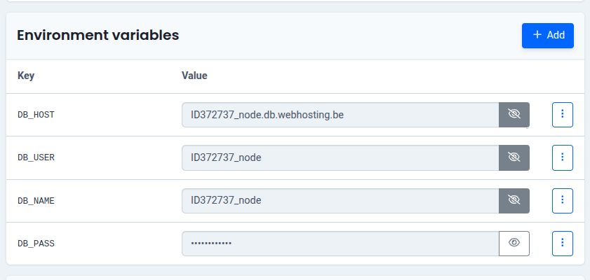

# Combell Hosting Setup for Snake Game Project

This guide walks you through setting up and deploying your Node.js Snake Game application on Combell's Git-based hosting.

## Prerequisites

- A Combell account with Git Deploy enabled
- Node.js ≥ 16 (we recommend Node 22)
- A GitHub repository containing your project
- A MySQL database on Combell (or elsewhere) with a scores table:

```SQL
CREATE TABLE scores (
  id INT AUTO_INCREMENT PRIMARY KEY,
  name VARCHAR(50) NOT NULL,
  score INT NOT NULL,
  created_at TIMESTAMP DEFAULT CURRENT_TIMESTAMP
);
```

## Database on Combell

Create a new or use an existing empty database on the combell platform.


## Add a Node.JS instance 

Add a new instance and fill out the input fields. I use node.js version 22 and my repository is public. Using the standard port (3000) is fine for this setup.


## Environment Variables

Locally, create a `.env` file (and add it to `.gitignore`) to test against your MySQL database:

```
DB_HOST=ID372737_node.db.webhosting.be
DB_USER=ID372737_node
DB_PASS=*********
DB_NAME=ID372737_node

```

On the Combell platform, set the same variables under Environment Variables so your live app can connect:



## Change website backend

To change the website backend to use Node.js. Go to:
Websites & SSL --> manage website --> change website backend


## Run the build pipeline

run the pipeline and wait about 11-13 minutes for the build to be completed and the webiste is live. 